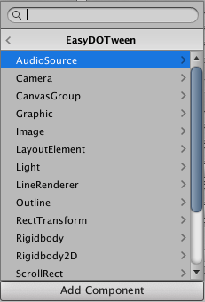
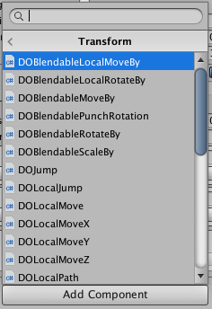
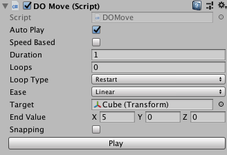
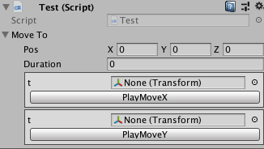

# EasyDOTween

提供各种`DOtween`的`Shortcut`扩展方法对应的`MonoBehaviour`包装类和`Tween`动画在`Editor`模式下的预览播放功能。

## 包装类

现只对`target`类型为`Component`的扩展方法进行了包装,
在`AddComponent`列表中按照`Component`实际类型分类显示，
方便进行查找。




所有包装类均派生自`Animation`泛型类，其泛型参数为`target`类型。
自定义包装类时同样只需继承`Animation`，实现`CreateTween`抽象方法即可。
自定义的包装类的`Inspector`同样具有预览按钮。

*如下为实现`DOMove`的代码*
```csharp
[AddComponentMenu("EasyDOTween/Transform/DOMove")]
public class DOMove : EasyDOTween.Animation<Transform>
{
    
    [SerializeField]
    private Vector3 endValue;
    
    [SerializeField]
    private bool snapping = false;
    
    protected override Tween CreateTween(Transform target, float duration)
    {
        return target.DOMove(endValue, duration, snapping);
    }
}
```

## 动画预览

每种包装类的`Inspector`界面都有预览按钮，
设置好`target`或者挂到含有`target`对应类别的`GameObject`下（*此时会将对应的`Component`设置为`target`*），
点击`Play`按钮即可在编辑器模式下预览`Tween`动画，如下图：



如果可序列化的类（*带有`Serializable`属性*）里含有返回值为`Tween`类型的方法，
可在该类型字段的属性列表里加入`TweenPreview`属性，
这之后可在`Inspector`中看到对应方法名的按钮，
设置好参数后点击即可进行编辑器模式下的预览。

```csharp
public class Test : MonoBehaviour
{
    [SerializeField, TweenPreview]
    MoveTo _moveTo;       

    [Serializable]
    class MoveTo
    {
        [SerializeField]
        Vector3 _pos;
        
        [SerializeField]
        float _duration;

        public Tween PlayMoveX(Transform t)
        {
            return t.DOMoveX(_pos.x, _duration);
        }

        public Tween PlayMoveY(Transform t)
        {
            return t.DOMoveY(_pos.y, _duration);
        }
    }
}
```

